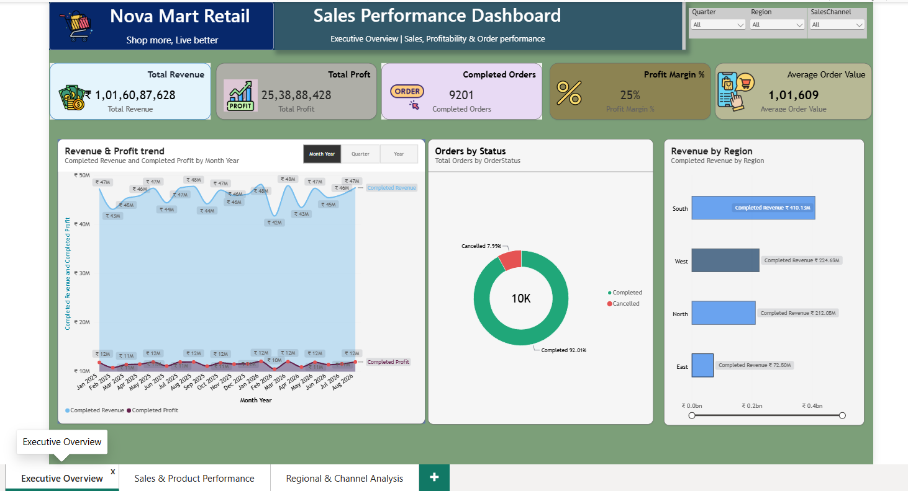
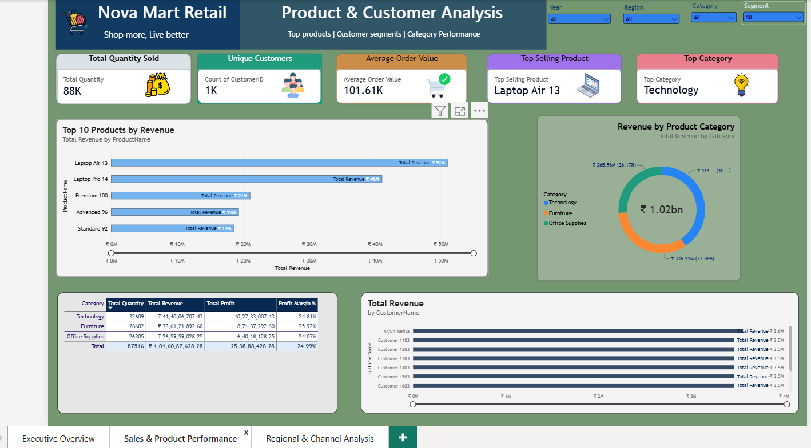
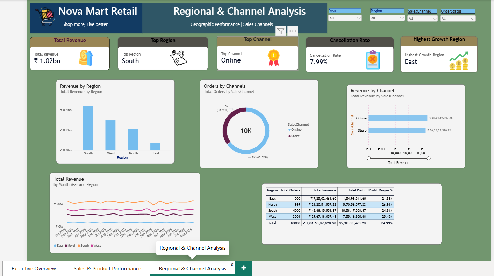

# NovaMart Retail — Sales & Customer Analytics

An end-to-end retail analytics project built using **SQL Server, Power BI, and DAX** to analyze sales performance, customer behavior, product performance, regional trends, and sales channels.

---

## 📊 Project Overview

NovaMart Retail is a fictional retail business with a synthetic dataset designed to simulate a real-world sales analytics environment.

The project demonstrates the complete analytics workflow:

**SQL Server → Data Preparation & Analysis → Power BI Data Model → DAX → Interactive Dashboard → Business Insights**

The objective was to transform transactional sales data into an interactive business intelligence solution that can help management understand revenue, profitability, product performance, customers, regions, and sales channels.

---

## 🎯 Business Objectives

The dashboard was designed to answer questions such as:

- How much revenue and profit is the business generating?
- Which products and categories perform best?
- Which regions generate the most revenue?
- Which sales channel performs better?
- What is the cancellation rate?
- How is revenue changing over time?
- Which customers contribute the most revenue?
- Which regions show the strongest growth?
- What are the overall profit margins?

---

## 🛠️ Tools & Technologies

| Technology | Purpose |
|------------|---------|
| **SQL Server** | Database creation, data generation, joins, transformations and analysis |
| **Power BI** | Data modeling, visualization and dashboard development |
| **DAX** | Measures, KPIs, time intelligence and analytical calculations |
| **GitHub** | Project version control and portfolio presentation |

---

## 🗄️ Data Model

The project uses a relational sales model consisting of:

- **Customers** — customer information and segmentation
- **Products** — product, category, cost and pricing information
- **Orders** — order-level transactions
- **OrderDetails** — product-level order transactions

A consolidated SQL analytical view was created to simplify reporting and connect transactional data with customer and product information.

---

## 📈 Power BI Dashboard

The Power BI report contains three analytical pages.

### 1. Executive Overview

Provides a high-level view of overall business performance.

**Key metrics include:**

- Total Revenue
- Total Profit
- Completed Orders
- Profit Margin
- Average Order Value
- Revenue & Profit Trend
- Orders by Status
- Revenue by Region



---

### 2. Product & Customer Analysis

Focuses on product performance and customer contribution.

**Key analysis includes:**

- Total Quantity Sold
- Unique Customers
- Average Order Value
- Top Selling Product
- Top Category
- Top 5 Products by Revenue
- Revenue by Product Category
- Top Customers by Revenue
- Category Performance



---

### 3. Regional & Channel Analysis

Provides a geographical and sales-channel perspective.

**Key analysis includes:**

- Total Revenue
- Top Region
- Top Sales Channel
- Cancellation Rate
- Highest Growth Region
- Revenue by Region
- Orders by Channel
- Revenue by Channel
- Monthly Revenue by Region
- Regional Performance Summary



---

## 🧮 DAX & Analytical Calculations

DAX was used to create business metrics and analytical calculations including:

- Total Revenue
- Total Cost
- Total Profit
- Profit Margin %
- Average Order Value
- Completed Revenue
- Completed Profit
- Completed Orders
- MoM Growth %
- YoY Growth %
- Previous Month Revenue
- Previous Year Revenue
- Running Revenue
- Cancellation Rate
- Top Selling Product
- Top Category
- Top Region
- Top Channel
- Highest Growth Region

Time intelligence was implemented using a dedicated Date Table and Power BI time-based calculations.

---

## 🔍 Key Business Metrics

The completed dataset contains:

- **10,000 Orders**
- **25,009 Order Details**
- **1,000 Customers**
- **100 Products**
- **~₹1.02 Billion Total Revenue**
- **~₹254 Million Total Profit**
- **~25% Overall Profit Margin**
- **~8% Cancellation Rate**

The dataset is synthetic and was generated specifically for portfolio and analytics demonstration purposes.

---

## 💡 Key Insights

The dashboard highlights several important business patterns:

- **South** is the highest-revenue region.
- **Online** is the leading sales channel.
- Technology products contribute strongly to overall sales performance.
- Regional profitability differs from regional revenue performance, demonstrating why revenue alone is not enough to evaluate performance.
- The dashboard allows users to move from high-level KPIs into product, customer, regional, and channel-level analysis.

---

## 📁 Repository Contents

```text
novamart-retail-sales-analytics/
│
├── README.md
│
├── NovaMartAnalytics.pbix
│
└── Screenshots/
    ├── Executive_Overview.png
    ├── Product_Customer_Analysis.png
    └── Regional_Channel_Analysis.png
